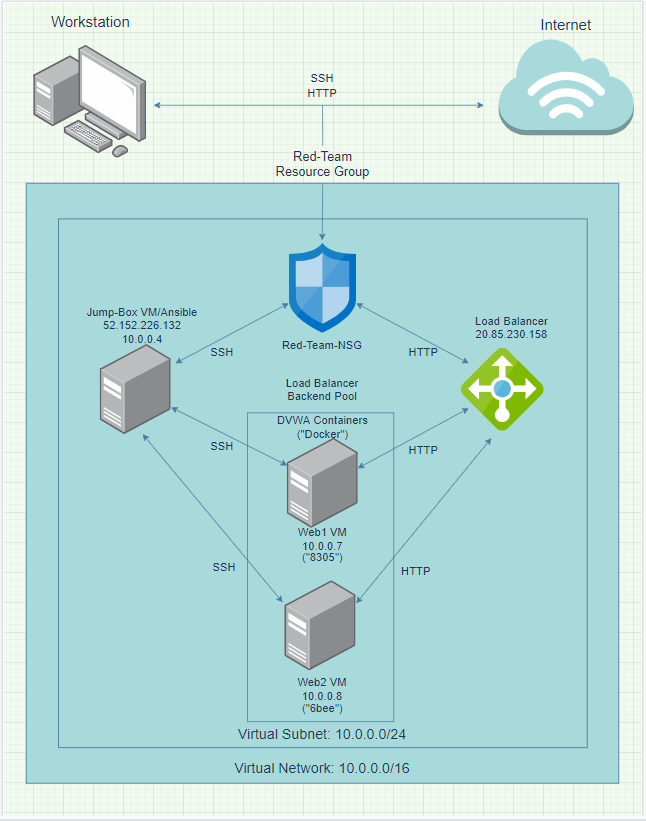

# Project-1
GitHub Fundamentals and Project 1 submission
## Automated ELK Stack Deployment

The files in this repository were used to configure the network depicted below.

These files have been tested and used to generate a live ELK deployment on Azure. They can be used to either recreate the entire deployment pictured above. Alternatively, select portions of the AnsibleConfig file may be used to install only certain pieces of it, such as Filebeat.

  Project-1/AnsibleConfig

This document contains the following details:
- Description of the Topology
- Access Policies
- ELK Configuration
  - Beats in Use
  - Machines Being Monitored
- How to Use the Ansible Build

### Description of the Topology

The main purpose of this network is to expose a load-balanced and monitored instance of DVWA, the D*mn Vulnerable Web Application.

Load balancing ensures that the application will be highly availible, in addition to restricting traffic to the network. Load balancers do this by evenly distributing website traffic on to multiple hardware servers. Load balancers make a website secure by mitigating against Denial of Service attacks. A jump box VM provides a single access point from the internet into your local network, effectively reducing the attack surface of your network. 

Integrating an ELK server allows users to easily monitor the vulnerable VMs for changes to the file systems of the VMs on the network and system metrics.
- Filebeat monitors the log files or locations that you specify, collects log events, and forwards them either to Elasticsearch or Logstash for indexing.
- Metricbeat takes the metrics and statistics that it collects and ships them to the output that you specify, such as Elasticsearch or Logstash.

The configuration details of each machine may be found below.
- Note: These IP Addresses are examples of what can be assigned to each respective VM.

| Name     | Function   | IP Address | Operating System |
|----------|------------|------------|------------------|
| Jump Box | Gateway    | 10.0.0.4   | Linux            |
| Web 1 VM | Web Server | 10.0.0.7   | Linux            |
| Web 2 VM | Web Server | 10.0.0.8   | Linux            |
| ELK      | Moniter    | 10.0.0.9   | Linux            |

### Access Policies

The machines on the internal network are not exposed to the public Internet. 

Only the Jump Box machine can accept connections from the Internet. Access to this machine is only allowed from a whitelisted public IP.  

Machines within the network can only be accessed by the jump box VM (10.0.0.4).

A summary of the access policies in place can be found in the table below.

| Name     | Publicly Accessible | Allowed IP Addresses |
|----------|---------------------|----------------------|
| Jump Box | Yes                 | [Whitelisted IP]     | 
| Web 1 VM | no                  | 10.0.0.1-254         |
| Web 2 VM | no                  | 10.0.0.1-254         |
| ELK      | no                  | 10.0.0.1-254         |

### Elk Configuration

Ansible was used to automate configuration of the ELK machine. No configuration was performed manually. This is an advantage because using Ansible to automate the configuration of the ELK machine allows the quick deploytation of the ELK server. This is especially useful if data is comprimised or corrupted. One can simply delete an existing machine and quickly ,as well as effortlessly, deploy a new one that already has all the right configurations. 

The playbook implements the following tasks:
- Install Docker
- Install Pip3
- Install Docker python module
- Increase virtual memory
- Download and launch a docker elk container

To use this playbook, one must log into the Jump Box, then issue:

    $ ansible-playbook ELK-Config.yaml elk. 

This runs the ELK-Config.yaml playbook on the elk host.

### Target Machines & Beats
This ELK server is configured to monitor the following machines:
- Web 1 VM (10.0.0.7)
- Web 2 VM (10.0.0.8)

We have installed the following Beats on these machines:
- Filebeat
- Metricbeat
- Packetbeat

These Beats allow us to collect the following information from each machine:
- Filebeat detects changes to the filesystem. Specifically, we use it to collect Apache logs.
- Metricbeat detects changes in system metrics, such as CPU usage. We use it to detect SSH login attempts, failed sudo escalations, and CPU/RAM statistics.
-  Packetbeat collects packets that pass through the NIC, similar to Wireshark. We use it to generate a trace of all activity that takes place on the network, in case later forensic analysis should be warranted.

The playbook below installs Metricbeat on the target hosts. The playbook for installing Filebeat is not included, but looks essentially identical — simply replace metricbeat with filebeat, and it will work as expected.

### Using the Playbook
In order to use the playbook, you will need to have an Ansible control node already configured. We use the jump box for this purpose. 

The easiest way to copy the playbooks is to use Git.
Run the commands below to download the files using git:

#### Make a files directory
 
 
    $ cd /etc/ansible
  
    $ mkdir files

#### Clone Repository + IaC Files
  
  
    $ git clone https://github.com/landhini/project-1.git

#### Move Playbooks and hosts file Into `/etc/ansible`
  
  
    $ cp project-1/playbooks/* .

    $ cp project-1/files/* ./files

SSH into the control node and follow the steps below:
- Copy the playbook files to Ansible Control Node.
- Update the hosts file to include which VMs to run each playbook on. It should look like the following:

        [webservers]
 
        10.0.0.5
 
        10.0.0.6

        [elk]
 
        10.0.0.8

- Run the playbooks by running the following commands:

 
        $ cd /etc/ansible
 
        $ ansible-playbook ELK-Config.yaml elk
 
        $ ansible-playbook beats-config webservers
 
  - Note: The playbook to install filebeat can made by modifing the beats-config file.

- navigate to or curl http://10.0.0.8:5601 to check that the installation worked as expected.

